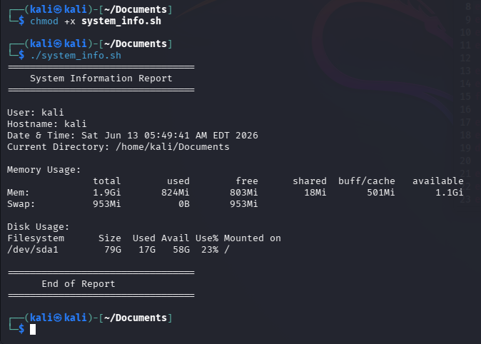
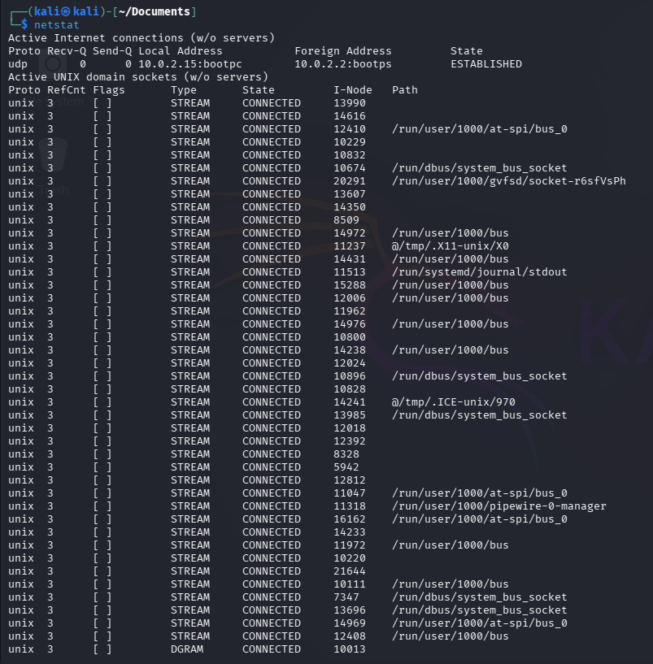
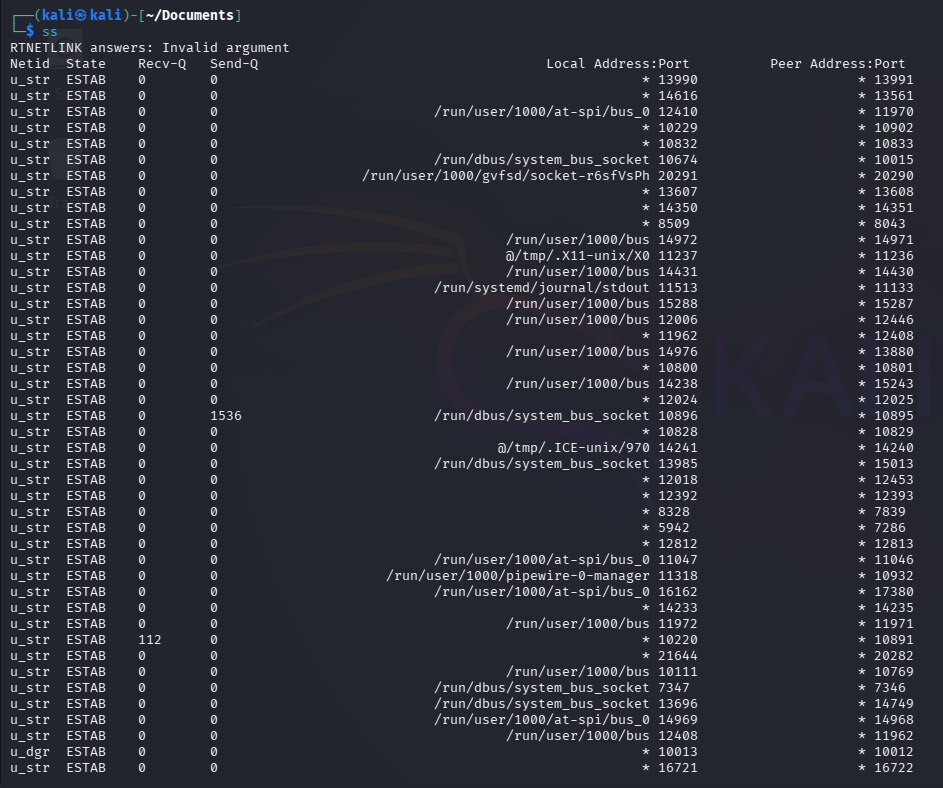
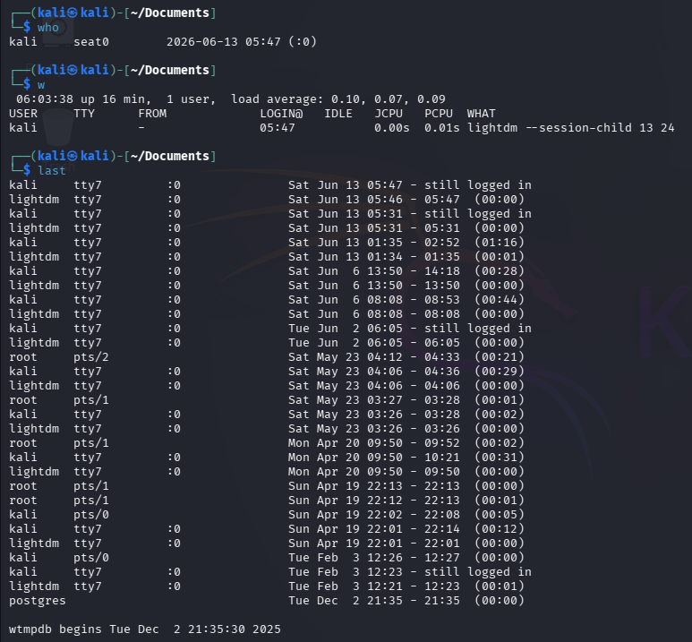

# Task A
1. What is a Process?
A process is a program that is currently running on a computer. Each process uses system resources such as CPU, memory, and storage to perform its tasks.
Example: Web browsers, terminal applications, and text editors are all processes when they are running.

2. What is a PID?
A PID (Process ID) is a unique number assigned by the operating system to each running process. It helps the system identify and manage processes.
Example:
PID 1234 → Firefox
PID 5678 → Terminal
Each running process has a different PID.

3. Which process is consuming the most CPU?
Open:
top
or
htop
Look at the %CPU column.
The process with the highest percentage is consuming the most CPU.
Example Answer:
The process consuming the most CPU was firefox with approximately 25% CPU usage.
Replace "firefox" and "25%" with the values from your system.

4. Which process is consuming the most Memory?
In top or htop, look at the %MEM column.
The process with the highest percentage is consuming the most memory.

# Part C
System Summary Report
System Information
•	Operating System: Kali Linux
•	Kernel Version: 6.12.13-amd64
Memory Information
•	Total RAM: 7.6 GiB
•	Available RAM: 5.0 GiB
Storage Information
•	Total Disk Size: 50 GB
•	Used Disk Space: 20 GB
•	Available Disk Space: 28 GB
•	Disk Usage: 42%
System Uptime
•	Uptime: 3 hours 25 minutes
Conclusion
This report provides an overview of the system's hardware resources and operating system status. The system has sufficient available memory and disk space and is running normally.

# Task D
1. What is a Service?
A service is a program that runs in the background and performs specific tasks without direct user interaction. Services start automatically or manually and help the operating system function properly.
Examples:
•	SSH Service 
•	NetworkManager 
•	Apache Web Server 
•	Database Services

2. Why are Services Important?
Services are important because they provide essential system functions such as network connectivity, remote access, printing, web hosting, and system monitoring. Many operating system features depend on services running correctly.

3. How Can a Stopped Service Affect a System?
If a service stops running, the functionality it provides becomes unavailable. This can cause system issues and prevent users from accessing certain features.
Examples:
•	If the SSH service stops, remote login will not work. 
•	If NetworkManager stops, network connections may fail. 
•	If a web server service stops, websites hosted on that server become inaccessible.

# PART E 

#!/bin/bash
echo "================================="

echo " System Information Report"

echo "================================="

echo ""

echo "User: $(whoami)"

echo "Hostname: $(hostname)"

echo "Date & Time: $(date)"

echo "Current Directory: $(pwd)"

echo ""

echo "Memory Usage:"

free -h

echo ""

echo "Disk Usage:"

df -h /

echo ""

echo "================================="

echo " End of Report"

echo "================================="

# TASK E 
1. netstat
Purpose:
netstat (Network Statistics) is used to display network connections, routing tables, interface statistics, and listening ports on a system.

Security Use Case

•	Detect unauthorized open ports. 
•	Identify suspicious network connections. 
•	Verify which services are listening on the system. 
Example: An attacker may open a hidden service on port 4444. netstat can help identify it.

2. ss
Purpose
ss (Socket Statistics) is a modern replacement for netstat. It displays network sockets and active connections more efficiently.

$ ss -tuln

•	Monitor active network connections. 
•	Detect unexpected listening services. 
•	Troubleshoot suspicious traffic. 
Example: Security administrators use ss to identify unknown applications communicating over the network.

3. who
Purpose
The who command displays information about users currently logged into the system.
Example Output

$ who

Security Use Case

•	Identify currently logged-in users. 
•	Detect unauthorized user access. 
•	Monitor shared systems. 
Example: If an unknown user account appears, it may indicate unauthorized access.

4. w
Purpose
The w command shows who is logged in and what they are currently doing.
Example Output

$ w

Security Use Case

•	Monitor user activity. 
•	Identify suspicious sessions. 
•	Detect unusual login behavior. 

Example: An administrator can see if a user is running unexpected processes.

5. last

Purpose

The last command displays the login history of users on the system.

$ last

Security Use Case

•	Audit login history. 

•	Investigate security incidents. 

•	Detect unauthorized login attempts. 

Example: If someone accessed the system at an unusual time, last can help identify when and from where.
 

# Part G: Mini SOC activity
1. How would you identify resource-heavy processes?
   
If a system is running slowly, I would first use commands such as top, htop, and ps aux to monitor running processes. These commands show CPU and memory usage in real time. I would look for processes consuming unusually high CPU or RAM, as they are often responsible for system performance issues.

2. How would you determine whether a process is suspicious?

I would check the process name, PID, owner, CPU usage, memory usage, and the location from which the process is running. I would also verify whether the process is a legitimate system service or an expected application. If the process has an unusual name, consumes excessive resources, starts automatically without reason, or maintains unexpected network connections, it may be suspicious and require further investigation.

3. What information would you collect before terminating a process?

Before terminating a process, I would collect important information such as:
•	Process Name
•	PID (Process ID)
•	User running the process
•	CPU and Memory usage
•	Command used to start the process
•	Related network connections
•	System logs and error messages
Collecting this information helps determine whether the process is malicious or a legitimate service. It also provides evidence for troubleshooting and future security analysis before taking action.
